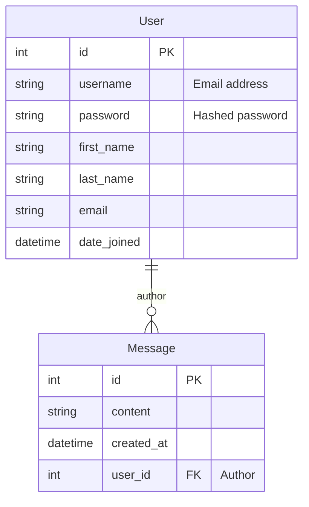

# Database and Data Model Guide

This document explains the database structure, data models, and relationships between tables for the Montanha Viva project.

**Database Technology:** [PostgreSQL](https://www.postgresql.org/)

---

## Data Model Schema (ERD)

The diagram below shows the main data models in the project and the relationships between them. This schema visualizes the relationship between Django's built-in `User` model and the sample `Message` model mentioned in `backend-guide.md`.

> **Diagram Explanation:**
> -   Each **User** can write multiple **Messages** (one-to-many relationship).
> -   The `user_id` field in the `Message` table is linked with a Foreign Key to the `id` field of the `User` table to indicate which user wrote the message.

---

## Model Details

### 1. User Model (`django.contrib.auth.models.User`)

This project uses Django's built-in user model for a quick start.

-   **Description:** Represents user accounts in the application. Authentication and authorization processes are handled through this model.
-   **Key Fields:**
    -   `id`: A unique primary key for each user.
    -   `username`: The field used to authenticate the user. In this project, the user's **email address** is assigned to this field during registration.
    -   `password`: The field where the user's password is securely stored after hashing.
    -   `email`: The user's email address.
    -   `first_name`: The user's first name.
    -   `last_name`: The user's last name.
    -   `is_active`: A boolean value indicating whether the account is active.
    -   `date_joined`: The date the account was created.

> #### 💡 Best Practice: Custom User Model
> As also mentioned in `backend-guide.md`, for real and long-term projects, the best practice is to create a **custom user model** by extending Django's `AbstractUser` model at the very beginning of the project. This makes it much easier to add new fields to the user model in the future (e.g., `profile_picture`, `date_of_birth`) and allows you to avoid complex database migrations.

### 2. Message Model (`api.models.Message`)

-   **Description:** This is an example model created for the protected and public endpoints mentioned in `backend-guide.md`. It represents a simple text message created by a user.
-   **Fields:**
    -   `id`: A unique primary key for each message.
    -   `content`: The text content of the message.
    -   `author` (`user_id`): A foreign key pointing to the user who created the message. This field is linked to the `User` model.
    -   `created_at`: The timestamp when the message was created. 